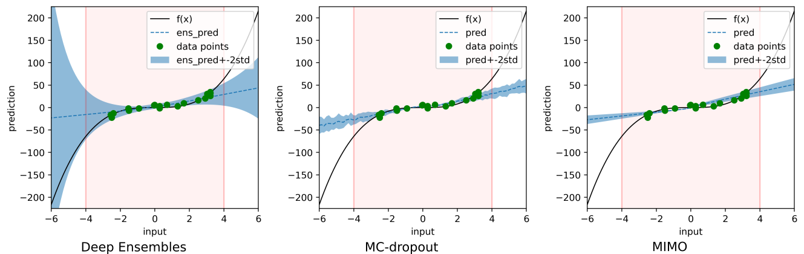

## References

1. Lakshminarayanan, B., Pritzel, A., & Blundell, C. (2016). Simple and scalable predictive uncertainty estimation using deep ensembles. arXiv preprint arXiv:1612.01474.
2. Gal, Y., & Ghahramani, Z. (2016, June). Dropout as a bayesian approximation: Representing model uncertainty in deep learning. In international conference on machine learning (pp. 1050-1059). PMLR.
3. Havasi, M., Jenatton, R., Fort, S., Liu, J. Z., Snoek, J., Lakshminarayanan, B., ... & Tran, D. (2020). Training independent subnetworks for robust prediction. arXiv preprint arXiv:2010.06610.

## TODO:  
~~1. Implement deep  ensembles~~  
~~2. Implement mcdrop~~  
~~3. Implement mimo~~   
~~4. Compare all~~ 

